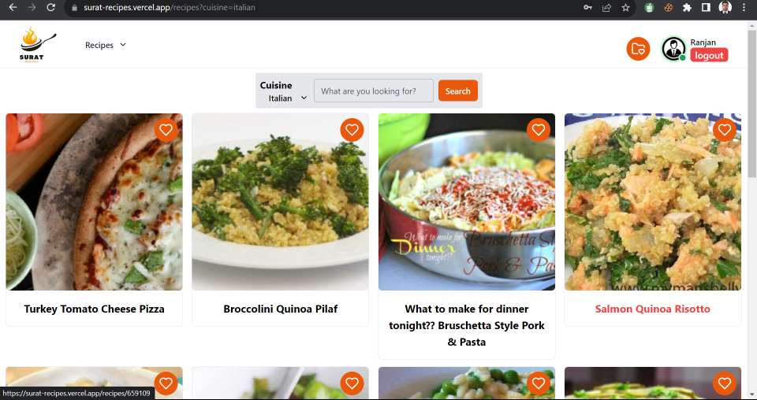
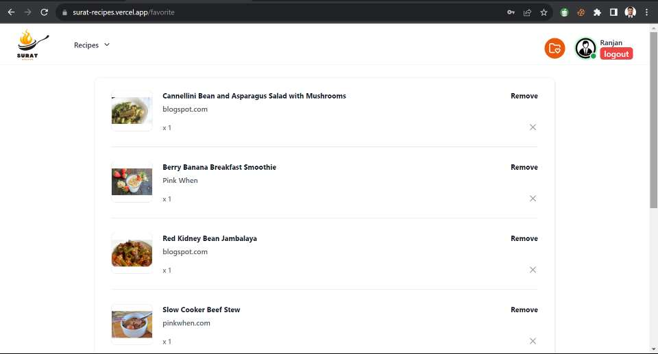

<!-- @format -->

# Welcome to SuratRecipes

Surat Recipe is a captivating web platform designed to celebrate the culinary heritage of Surat. Commissioned by WEBLEDGER SOLUTIONS PRIVATE LIMITED as part of an assessment, this project is an immersive exploration of the rich flavors and culture associated with Surati cuisine.

| No. | Topic         | Link                                       |
| --- | ------------- | ------------------------------------------ |
| 01  | deployed link | https://surat-recipes-ranjan095.vercel.app |
| 02  | GitHub repo   | https://github.com/Ranjan095/SuratRecipes  |

# Project Setup

Follow these steps to set up the Project to your local machine useng Gitbash:

### Clone the Repository

- `git clone [https://github.com/your-username/your-repo.git](https://github.com/Ranjan095/SuratRecipes.git)`

### there is two folder here

- `backend`
- `frontend`

## Go to the Backend Setup

Follow these steps to set up the backend for this project:

### Step 1: Change the directory

- `cd backend`

### Step 2: Create a .env File

| No. | variable     | value                               |
| --- | ------------ | ----------------------------------- |
| 01  | MONGO_URL    | ..........................          |
| 02  | TOKEN_SECRET | WEBLEDGER-SOLUTIONS-PRIVATE-LIMITED |
| 03  | PORT         | 8080                                |

### Step 3: Install Dependencies

- `npm install`

### Step 4: Start the Backend

- `npm run server`

## Frontend Setup

### Step 1: Change the directory

- `cd ..`
- `cd frontend`

### Step 2: Install Dependencies

- `npm install`

### Step 3: Start the Frontend

- `npm run dev`

**Note** - `In the development of this project, we have harnessed the capabilities of the free version of the Spoonacular API. It's worth noting that the free version comes with certain daily usage limits. If you encounter any errors related to these limits while using our platform, there's a simple solution: Register for an account on the official Spoonacular API website and obtain your unique API key. Then, to seamlessly address this issue within our project, proceed to the 'frontend/src/assets/URL/API_KEY' directory. Here, you can replace the existing API key with the one you've acquired.`

## Key Features:

### 1. Homepage:

Surat Recipe welcomes users with an inviting homepage, adorned with vibrant images and a user-friendly layout, setting the stage for a gastronomic adventure through Surat's culinary wonders.

### 2. Recipe Page

At the heart of this project is the Recipe Page, a treasury of traditional and contemporary Surati recipes. The intuitive interface allows users to seamlessly explore the diverse culinary offerings of Surat.

### 3. Login & Sign-up Pages:

Robust user authentication ensures that users can create accounts, enhancing their engagement and allowing them to save their favorite recipes.

### 4. Favourite Recipe:

Users can mark their beloved Surati recipes as favorites, simplifying their ability to revisit and share these culinary gems with others.

### 5. Single Product Page:

Each recipe is presented in detail, with step-by-step instructions, a list of ingredients, and additional insights into the rich history and cultural significance of the dish.

### 6. Search and Recipe Filtering:

A distinctive feature of Surat Recipe, this functionality enables users to search for recipes tailored to their personal culinary preferences, making it easier to explore Surati dishes that match their tastes.

### 7. Spoonacular API Integration:

Surat Recipe stands out with its seamless integration of the Spoonacular API, a culinary data powerhouse. This integration greatly enriches the project by providing an extensive database of recipes, ingredients, and culinary insights. Through the Spoonacular API, users can explore an even wider array of Surati recipes, discover unique ingredients, and access valuable cooking tips, making Surat Recipe a comprehensive culinary resource for both novice and experienced cooks. This feature ensures that users have access to a diverse and ever-expanding collection of Surati recipes and a wealth of culinary knowledge, elevating their culinary journey on Surat Recipe.
